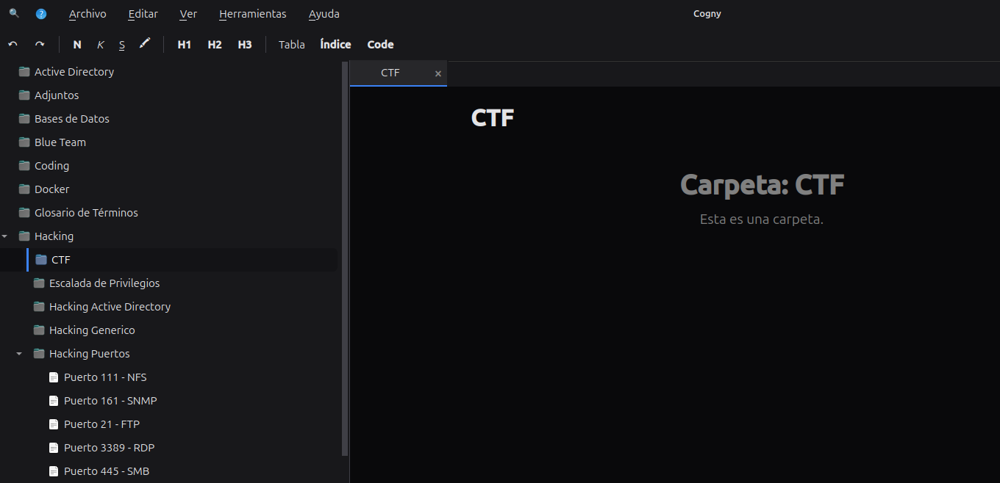
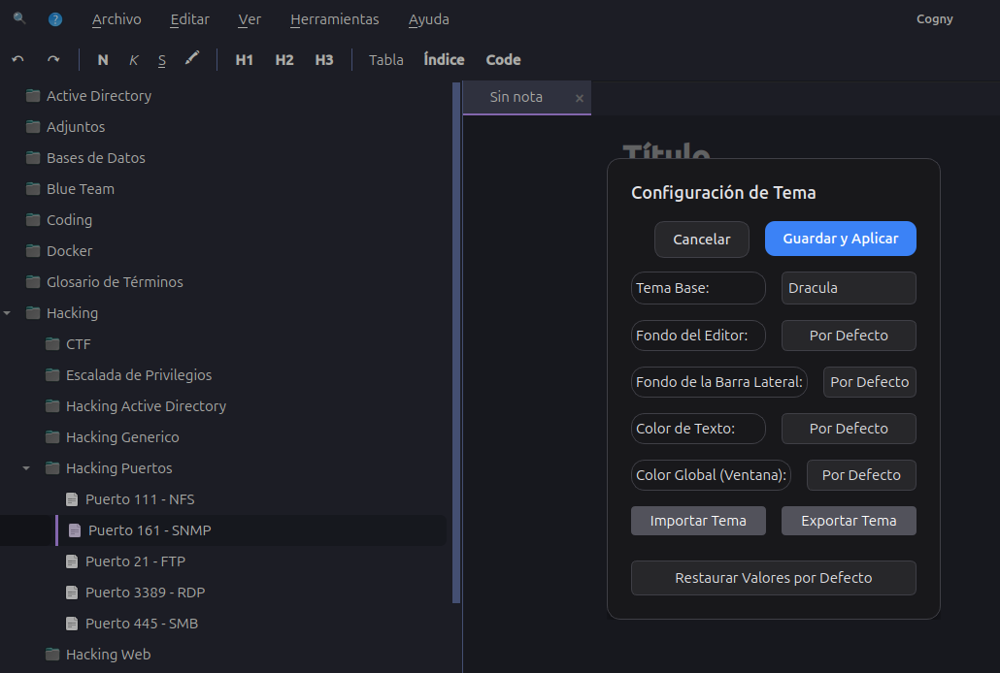
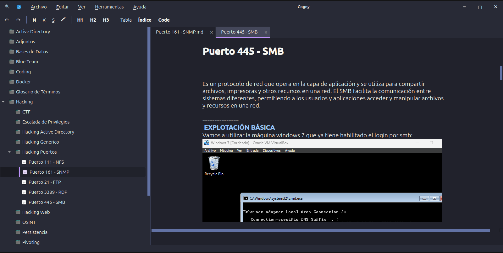

# Cogny 🧠
> **Tu Base de Conocimiento Inteligente y Gestor de Notas.**

<div align="center">
  
</div>

**Cogny** es una potente aplicación para la toma de notas jerárquicas diseñada para desarrolladores y usuarios avanzados. Construida con Python y PySide6, ofrece una experiencia fluida para organizar información compleja, fragmentos de código y documentación.

## 📸 Capturas de Pantalla

### Interfaz Principal
Gestiona tu conocimiento con un diseño limpio de doble panel. El árbol jerárquico te permite estructurar notas profundamente anidadas, mientras que el editor soporta un formato Markdown enriquecido.


### Estadísticas e Insights
Visualiza tus hábitos de escritura y el crecimiento de tu base de datos.


### Bóveda Segura
Mantén protegida tu información sensible.


---

## ✨ Características Clave

-   **Organización Jerárquica**: Crea carpetas y notas anidadas ilimitadas. Arrastra y suelta para reorganizar sin esfuerzo.
-   **Protección Estricta de Estructura**: 
    -   Evita el anidamiento accidental en notas finales (lógica de rebote).
    -   Las carpetas actúan como contenedores (solo lectura) para mantener la estructura limpia.
-   **Editor Markdown Enriquecido**:
    -   Resaltado de sintaxis para bloques de código (Python, SQL, Bash, etc.).
    -   Código en Línea: Texto entre comillas (` `texto` `) se muestra con énfasis.
    -   Auto-formato (listas, encabezados).
    -   **Copia de Código**: Botones de copia con un clic para fragmentos de código.
-   **Zoom Centrado en el Usuario**:
    -   **Zoom de Texto**: Ajusta el tamaño de fuente independientemente (`Ctrl + / -`).
    -   **Zoom de Imagen**: Escala imágenes independientemente (`Ctrl + Shift + / -`).
    -   *Sin zoom accidental con Ctrl+Rueda.*
-   **UI Moderna**: Soporte para temas claro/oscuro (personalizable).

## 🚀 Empezando

### Prerrequisitos
-   Python 3.10+
-   `pip install -r requirements.txt` (Principalmente `PySide6`)

### Ejecutar la Aplicación
```bash
python main.py
```

## 🛠️ Configuración
-   **Base de Datos**: Las notas se almacenan en `notes.cdb` (SQLite).
-   **Assets**: Las imágenes y adjuntos se gestionan internamente.

## 📈 Historial de Estrellas

[](https://star-history.com/#Maalfer/cogny&Date)

---
*Creado por El Pingüino de Mario.*
