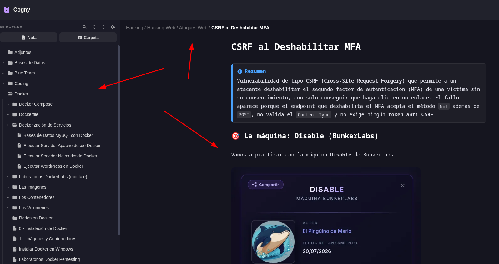
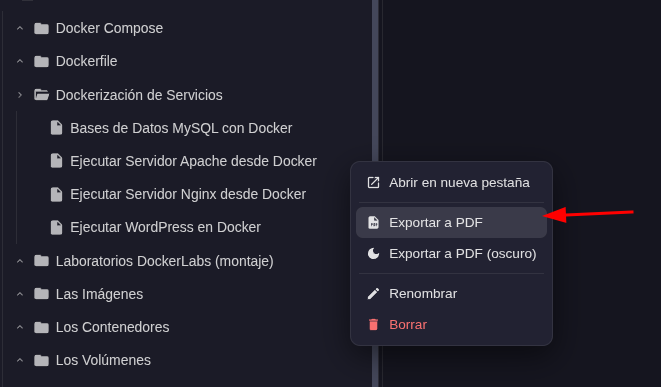
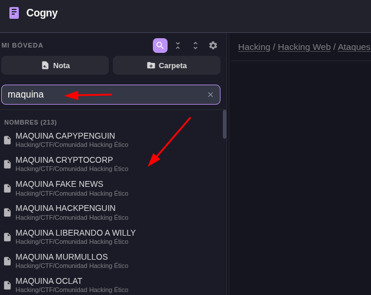

<p align="center">
  
</p>

<h1 align="center">Cogny</h1>
<p align="center">Bóveda de notas en Markdown, autoalojada y minimalista.</p>

<p align="center"></p>

## Descripción

Cogny es una aplicación web de notas al estilo Obsidian construida con Django. Las notas viven como archivos Markdown en disco, organizadas en carpetas, sin depender de una base de datos para el contenido. Incluye editor con resaltado de código, fórmulas, diagramas, adjuntos y exportación a PDF con fidelidad completa.

## Capturas

<table>
<tr>
<td width="50%"><br><sub>Exportar cualquier nota a PDF, en claro u oscuro.</sub></td>
<td width="50%"><br><sub>Búsqueda instantánea por nombre y contenido.</sub></td>
</tr>
</table>

## Características

- Notas en Markdown organizadas en carpetas, guardadas como archivos en disco.
- Editor con resaltado de sintaxis, fórmulas (KaTeX), diagramas (Mermaid) y callouts.
- Exportación de notas a PDF, con imágenes y estilos incrustados.
- Búsqueda instantánea por nombre y por contenido.
- Adjuntos con optimización automática de imágenes a WebP.
- Importación y exportación de la bóveda completa en un único ZIP.
- Progressive Web App instalable, con caché de estáticos para uso offline.

## Stack

- **Backend**: Django + gunicorn (WSGI).
- **Datos**: SQLite para cuentas de usuario; las notas y adjuntos son archivos en disco.
- **Frontend**: JavaScript nativo, sin framework ni paso de compilación.
- **Exportación a PDF**: Chromium headless.

## Desarrollo local

```bash
python -m venv venv && source venv/bin/activate
pip install -r requirements.txt
cp .env.example .env   # completa DJANGO_SECRET_KEY y las rutas de datos
python manage.py migrate
python manage.py runserver
```

## Despliegue

`scripts/cogny.service` es la referencia de la unidad systemd usada en producción (gunicorn detrás de un proxy inverso con TLS). Tras cualquier cambio en los estáticos, ejecuta `collectstatic`, sube `ASSET_VERSION` en `.env` y reinicia el servicio para invalidar la caché.
